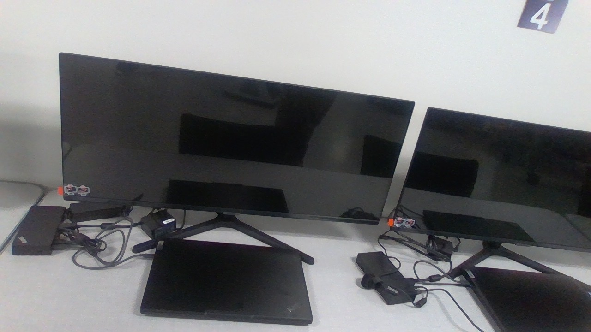

# CS Lab Workstation

 Image | August 2026 

## Summary

Set up computer science workstation assembled by me during class.

**Project:** CS Lab Launch

**My role:** Inventory and assembly 

## The Artifact

[Picture](https://github.com/Creb206/Apex-Portfolio/blob/main/artifacts/artifact-name/IMG_20260817_111545.jpg)

[View the full artifact](Workstation.jpg)

## Skills Demonstrated

Inventorying
Hardware Management
Responsibility

## Tools and Technologies

- Cable Management
- Hardware Setup

## Implementation

This work station was set up with a widescreen monitor, docking port, and laptop. I set it up over the course of a few dozen minutes and ensured it worked and cables were well managed.

## What I Learned

I learned how to effectively set up a work station while ensuring parts were inventoried.

---

[Return to All Artifacts]({{ '/artifacts.html' | relative_url }})
